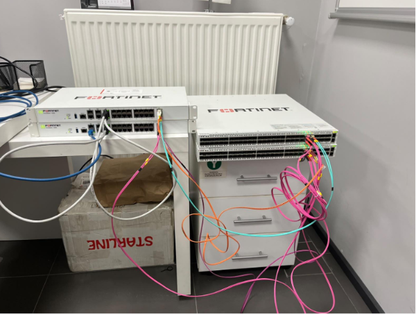
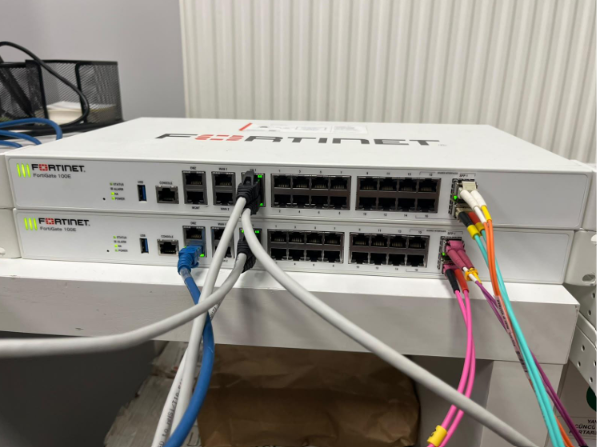
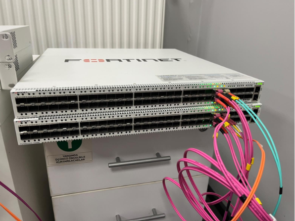
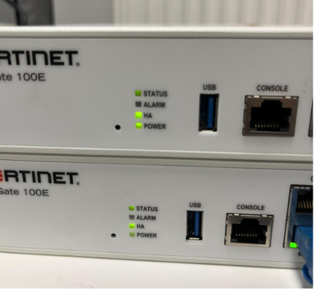

# fortinet-ha-mclag-lab
Enterprise-grade High Availability network infrastructure implemented on physical FortiGate 100E and FortiSwitch 1048E devices using FortiLink and MC-LAG.

# FortiGate High Availability  
## FortiLink Managed MC-LAG Architecture

Physical laboratory implementation using FortiGate 100E and FortiSwitch 1048E devices.

---

## Project Overview

This project was completed during our internship at **Ultron Bilişim** by:

- **Ayşe Gül Pekgöz**
- **İsmail Taşinen**
- **Ramazan Erten**

with the mentorship of **Fatih Turan**.

The aim of the project was to design and implement a redundant network infrastructure by eliminating single points of failure at both the firewall and switching layers.

The entire implementation was carried out on physical Fortinet devices in a laboratory environment.

---

## Hardware

| Device | Quantity |
|---|---:|
| FortiGate 100E | 2 |
| FortiSwitch 1048E | 2 |

---

## Technologies Used

- FortiGate High Availability in Active-Passive mode
- FortiLink
- MC-LAG
- Inter-Chassis Link
- IEEE 802.3ad Link Aggregation
- Session Pickup
- CLI and GUI verification
- TFTP firmware recovery

---

## Network Topology

The two FortiGate devices operate as an Active-Passive HA cluster.

Each FortiGate is connected to both FortiSwitch devices through FortiLink. The FortiSwitch units operate as an MC-LAG peer group and communicate through an Inter-Chassis Link.

This architecture provides redundancy at both the firewall and switching layers.

---

## Implementation Process

1. Physical installation and cabling  
2. FortiGate HA cluster configuration  
3. HA synchronization verification  
4. FortiLink aggregate configuration  
5. FortiSwitch discovery and authorization  
6. Inter-Chassis Link configuration  
7. MC-LAG peer group configuration  
8. CLI and GUI verification  
9. Troubleshooting and firmware recovery  
10. Technical documentation  

---

## Project Images

### Laboratory Setup

### FortiGate High Availability

### FortiSwitch MC-LAG

### HA Status

---

## Verification

The following components were verified during the implementation:

- Primary and secondary HA roles
- Configuration synchronization
- FortiLink connectivity
- FortiSwitch authorization
- MC-LAG peer status
- Inter-Chassis Link status
- Aggregate interface state
- Physical link status

---

## Troubleshooting

During the project, several real-world issues were encountered and resolved:

- FortiLink discovery problems
- FortiSwitch authorization issues
- Fiber and physical connectivity problems
- Firmware compatibility issues
- TFTP-based firmware recovery
- HA synchronization checks
- Aggregate interface configuration

---

## Documentation

Detailed Turkish and English engineering reports are included in this repository:

- [Engineering Report (Turkish)](Fortinet_HA_Report_TR.pdf)
- [Engineering Report (English)](Fortinet_HA_Report_EN.pdf)

---

## Contributors

**Project Team**

- Ayşe Gül Pekgöz
- İsmail Taşinen
- Ramazan Erten

**Mentor**

- Fatih Turan

---

## Organization

This project was completed during our internship at **Ultron Bilişim**.

---

## Disclaimer

Sensitive information such as passwords, serial numbers and organization-specific configuration values has been removed or masked.

This repository is shared for educational and portfolio purposes.
