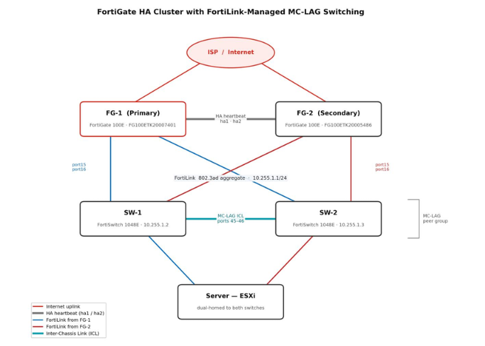

# fortinet-ha-mclag-lab
Enterprise-grade High Availability network infrastructure implemented on physical FortiGate 100E and FortiSwitch 1048E devices using FortiLink and MC-LAG.
# FortiGate HA with FortiLink Managed MC-LAG

This project was completed during our internship at **Ultron Bilişim**.

## Team

- Ayşe Gül Pekgöz
- İsmail Taşinen
- Ramazan Erten

Mentor: Fatih Turan

---

## Hardware

- 2 × FortiGate 100E
- 2 × FortiSwitch 1048E

## Technologies

- FortiGate High Availability
- FortiLink
- MC-LAG
- Inter-Chassis Link

## Network Topology

## Laboratory

## FortiGate HA

## FortiSwitch MC-LAG

## Verification

## Reports

- Engineering_Report_TR.pdf
- Engineering_Report_EN.pdf
